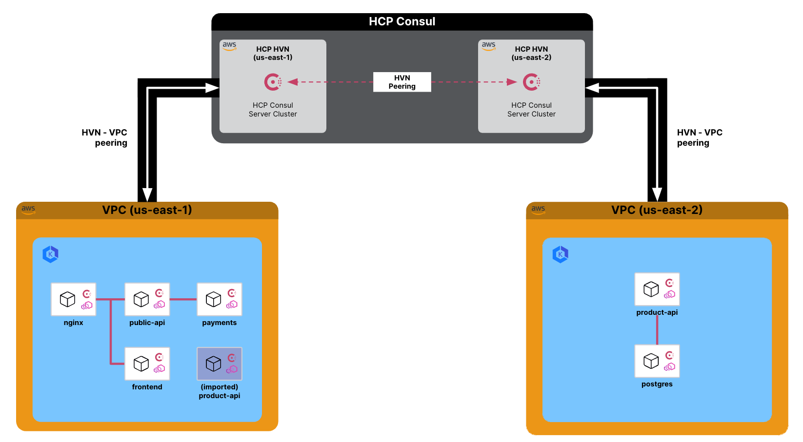

# HCP Consul Cluster Peering Demo

This repo will contain everything you need to deploy HCP Consul, AWS EKS and a HashiCup application with various services.

## Table of Contents

- [Prerequisites](#prerequisites)
- [Description](#description)
- [Demo Steps](#steps)
- [Contributors](#contributors)

## Prerequisites

This demo repo utilises the following products in order to successfully operate:

1. Terraform ([Installation Setup](https://developer.hashicorp.com/terraform/tutorials/aws-get-started/install-cli))
2. Terraform Cloud ([Sign up link](https://app.terraform.io/public/signup/account))
3. HCP Consul ([Sign up link](https://portal.cloud.hashicorp.com/sign-up))
   - [Service Principal Setup](https://developer.hashicorp.com/hcp/docs/hcp/security/service-principals#create-a-service-principal)
4. AWS Account ([Sign up link](https://aws.amazon.com/resources/create-account/))
   - [Retrieve Access Keys](https://docs.aws.amazon.com/IAM/latest/UserGuide/id_credentials_access-keys.html)

_Additional configuration to the code can be made to enable it to operate in your own environments_

## Description

In this demo, you will:

- Deploy 2 managed Kubernetes environments with Terraform
- Deploy 2 HCP Consul with Terraform
- Deploy parts of microservices from HashiCups, a demo application, across both Kuberenetes cluster
- Conduct Cluster Peering through the HCP Consul Management Plane
- Connect services across the peered HCP Consul clusters

### Scenario Overview

HashiCups is a coffee-shop demo application. It has a microservices architecture and uses Consul service mesh to securely connect the services. In this tutorial, you will deploy HashiCups services on Kubernetes clusters in two different AWS regions. By peering the Consul clusters, the frontend services in one region will be able to communicate with the API services in the other.

HashiCups uses the following microservices:

1. `nginx service`

   - Description: NGINX instance that routes requests to the frontend microservice and serves as a reverse proxy to the public-api service.

2. `frontend service`

   - Description: Provides a React-based UI.

3. `public-api service`

   - Description: GraphQL public API that communicates with the products-api and the payments services.

4. `product-api service`

   - Description: Stores the core HashiCups application logic, including authentication, coffee (product) information, and orders.

5. `postgres service`

   - Description: Postgres database instance that stores user, product, and order information.

6. `payments service`
   - Description: gRPC-based Java application service that handles customer payments.

## How-to Steps

1. Deploy Kubernetes clusters and HCP Consul

`terraform -chdir=dc1 init`
`terraform -chdir=dc1 apply --auto-approve`

## Contributors

Thank you Tony Phan for helping me troubleshoot and expanding my knowledge about HashiCorp Consul
